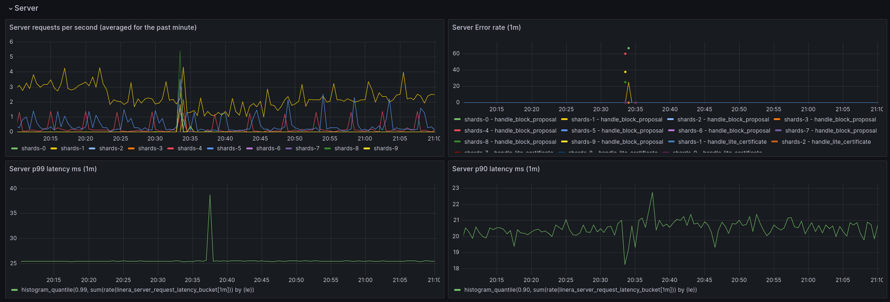

# Monitoring and Logging

This section covers how to monitor the behaviour and performance of your
validator once deployed.

## Monitoring

The validator ships with an instance of [Prometheus](https://prometheus.io/) for
metrics and [Grafana](https://grafana.com/) for observability.

Grafana ships with a default dashboard called the "General" dashboard which
displays the most common metrics for validator operation, from latency to error
rates.



The relevant ports can be found in the
[Docker Compose manifest](https://github.com/linera-io/linera-protocol/blob/main/docker/docker-compose.yml).

## Logging

Logging is currently handled implicitly by Docker as it absorbs the process
stdout from the proxy and shard processes.

To view the logs for a given container run:

```bash
docker compose logs <service-name>
```
